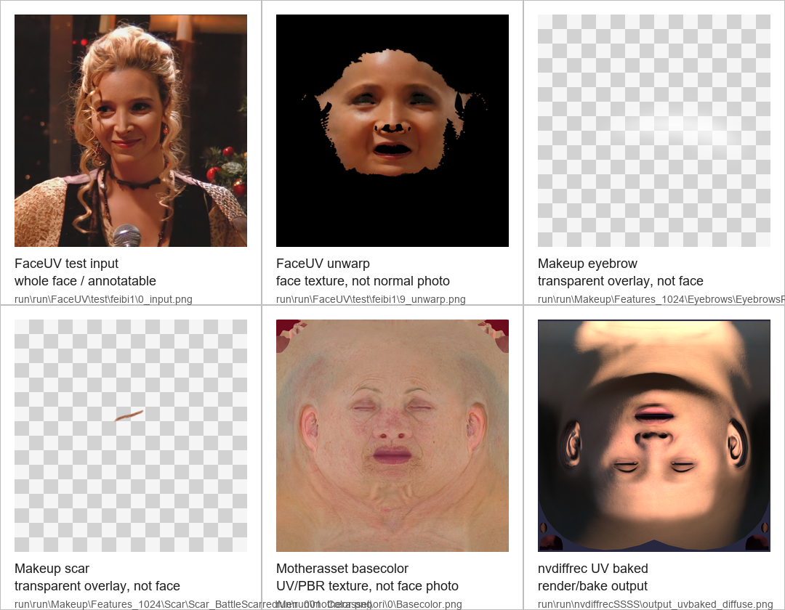

# Run Asset Inventory

Scan date: 2026-06-16

Root scanned: `run/run`

Purpose: identify which extracted assets can be used directly as 2D image inputs, which require 3D-to-2D rendering or texture baking, and which should be excluded from any processing pipeline.

## Summary

| Scope | Files | Size | Notes |
| --- | ---: | ---: | --- |
| `run/` expanded tree | 9009 | 47.3 GB | Extracted asset package. It still contains a nested `run/run` directory. |
| `run.zip` | 1 | 43.27 GB | Original archive, ignored by git. |
| Git status | n/a | n/a | `run/` and `run.zip` are ignored by `.gitignore`; only `.gitignore` is tracked as a pending repo change. |

Top-level contents under `run/run`:

| Path | Files | Size | Main extensions | Classification |
| --- | ---: | ---: | --- | --- |
| `motherasset/` | 1494 | 33.58 GB | `.png`, `.bak` | PBR texture sets; needs selection or 2D bake/render rules. |
| `FaceUV/` | 4142 | 9.71 GB | `.png`, `.py`, `.jpg`, `.pyc`, `.obj` | Mixed toolchain, generated outputs, tests, duplicated assets, model files. |
| `skintone/` | 24 | 1.95 GB | `.txt`, `.py`, `.pyc`, `.png`, `.json` | Duplicate of `FaceUV/skintone`; likely exclude one copy. |
| `fbx/` | 388 | 1.15 GB | `.fbx` | 3D models; requires rendering or UV baking to become 2D. |
| `nvdiffrecSSSS/` | 227 | 0.50 GB | `.py`, `.png`, `.pyc`, `.json`, `.h` | NVIDIA nvdiffrec-derived render/UV bake tool directory; useful reference, not clean asset input. |
| `Makeup/` | 2728 | 0.42 GB | `.png`, `.json`, `.py` | Cleanest direct 2D asset candidate. |
| `assets/` | 6 | ~0 GB | `.xlsx`, `.json`, `.npy`, `.png` | Metadata and small support assets. |

Full extension distribution, top entries:

| Extension | Count |
| --- | ---: |
| `.png` | 7149 |
| `.py` | 412 |
| `.fbx` | 388 |
| `.jpg` | 277 |
| `.pyc` | 240 |
| `.json` | 69 |
| `.obj` | 64 |
| `.txt` | 62 |
| `.bak` | 55 |
| `.yaml` | 41 |
| `.sh` | 37 |
| `<no_ext>` | 28 |

## Whole-Face Vs Texture Assets

Not every 2D image is a whole-face image. For this project, the important distinction is:

| Class | Example | Is it a natural whole-face input? | Use in current annotator |
| --- | --- | --- | --- |
| Whole-face photo/render | `FaceUV/test/feibi1/0_input.png` | Yes | Good for face contour annotation. |
| Face unwarp / projected texture | `FaceUV/test/feibi1/9_unwarp.png` | No | Useful as texture/debug reference, not normal outline annotation input. |
| Makeup overlay | `Makeup/Features_1024/*/*.png` | No | Transparent decal/mask/feature assets. Useful for cataloging, not whole-face annotation. |
| PBR/UV face texture | `motherasset/ori/*/Basecolor.png` | No | UV-space head/face texture. Needs render or special UV annotation workflow. |
| UV baked render output | `nvdiffrecSSSS/output_uvbaked_diffuse.png` | No | Render/bake output; may help validate conversion but is not a regular face photo. |
| FBX model | `fbx/*.fbx` | Not an image | Needs orthographic render or UV bake to become 2D. |

Visual reference:

Practical consequence:

- If the target is the existing face-contour annotator, use whole-face photos/renders as inputs.
- `Makeup` PNGs are already 2D, but they are not whole faces; they are overlays or feature decals.
- `motherasset/ori/*/Basecolor.png` is already 2D, but it is UV-space texture, not camera-space face imagery.
- `fbx/*.fbx` is the main candidate when we need to generate new whole-face 2D views from 3D assets.

## Direct 2D Candidates

### `Makeup/`

`run/run/Makeup` is the cleanest ready-to-use 2D asset set. It contains 2728 files, 2720 of which are PNGs.

`run/run/Makeup` and `run/run/FaceUV/data_aug/Makeup` have identical relative paths and file sizes for all 2728 files. Treat `FaceUV/data_aug/Makeup` as a duplicate unless a later hash check proves otherwise.

`Makeup/Features`:

| Category | Files | Size |
| --- | ---: | ---: |
| `Scar` | 11 | 170.8 MB |
| `Appliquemask` | 1263 | 74.2 MB |
| `Features` | 13 | 48.4 MB |
| `Scar_Resized` | 11 | 41.3 MB |
| `Eyebrows` | 18 | 19.8 MB |
| `Applique` | 6 | 8.0 MB |
| `Blushes` | 6 | 0.9 MB |
| `Eyeliner` | 14 | 0.7 MB |
| `Eyeshadow` | 6 | 0.6 MB |
| `Lipsticks` | 8 | 0.5 MB |
| `Local` | 1 | ~0 MB |

`Makeup/Features_1024`:

| Category | Files | Size |
| --- | ---: | ---: |
| `Appliquemask` | 1263 | 28.9 MB |
| `Scar_Resized` | 11 | 11.6 MB |
| `Scar` | 11 | 11.5 MB |
| `Features` | 13 | 3.6 MB |
| `Applique` | 6 | 2.0 MB |
| `Eyebrows` | 18 | 1.7 MB |
| `Blushes` | 6 | 0.1 MB |
| `Eyeshadow` | 6 | 0.1 MB |
| `Eyeliner` | 14 | 0.1 MB |
| `Lipsticks` | 8 | 0.1 MB |
| `Local` | 1 | ~0 MB |

Representative dimensions:

| File | Dimensions | Format | Notes |
| --- | --- | --- | --- |
| `Makeup/Features/Eyebrows/EyebrowsReal_DarkMask_001.png` | 4096 x 4096 | 32-bit ARGB | High-resolution transparent PNG. |
| `Makeup/Features_1024/Eyebrows/EyebrowsReal_DarkMask_001.png` | 1024 x 1024 | 32-bit ARGB | Scaled version. |
| `Makeup/Features/Scar/Scar_BattleScarredMen_001_Color.png` | 4096 x 4096 | 32-bit ARGB | High-resolution texture. |
| `Makeup/Features_1024/Scar/Scar_BattleScarredMen_001_Color.png` | 1024 x 1024 | 32-bit ARGB | Scaled version. |
| `Makeup/Features/Appliquemask/Paint_00001.png` | 2048 x 2048 | 32-bit ARGB | Mask texture. |
| `Makeup/Features_1024/Appliquemask/Paint_00001.png` | 1024 x 1024 | 32-bit ARGB | Scaled version. |

Recommended first pass:

- Prefer `Makeup/Features_1024` for fast annotation/import experiments.
- Keep `Makeup/Features` as high-resolution source material.
- Exclude `FaceUV/data_aug/Makeup` unless needed for provenance.

### Existing Render Outputs

These are already 2D outputs and can be inspected or reused as references:

- `FaceUV/test/*/*.png`
- `nvdiffrecSSSS/output_diffuse.png`
- `nvdiffrecSSSS/output_pbr.png`
- `nvdiffrecSSSS/output_bssrdf.png`
- `nvdiffrecSSSS/output_uvbaked_diffuse.png`
- `nvdiffrecSSSS/output_uvbaked_pbr.png`
- `nvdiffrecSSSS/output_uvbaked_bssrdf.png`
- `nvdiffrecSSSS/projected.png`

Representative dimensions:

| File | Dimensions | Format |
| --- | --- | --- |
| `FaceUV/test/feibi1/0_input.png` | 1000 x 1000 | 24-bit RGB |
| `FaceUV/test/feibi1/9_unwarp.png` | 1024 x 1024 | 24-bit RGB |
| `nvdiffrecSSSS/projected.png` | 1024 x 1024 | 24-bit RGB |
| `nvdiffrecSSSS/output_uvbaked_diffuse.png` | 2048 x 2048 | 32-bit ARGB |

## Conversion Candidates

### `motherasset/ori`

`motherasset/ori` contains 420 numbered directories from `0` through `419`. Every directory has `Basecolor.png`, but the rest of the map set is inconsistent.

File name coverage:

| File name | Count |
| --- | ---: |
| `Basecolor.png` | 420 |
| `Normal.png` | 417 |
| `Roughness.png` | 201 |
| `Specular.png` | 200 |
| `Cavity.png` | 153 |
| `Basecolor.png.bak` | 55 |
| `SR.png` | 44 |
| `ch_0_B.png` | 1 |
| `ch_1_G.png` | 1 |
| `ch_2_R.png` | 1 |
| `ch_3_A.png` | 1 |

Directory completeness:

| Files per numbered directory | Directory count |
| ---: | ---: |
| 1 | 1 |
| 2 | 65 |
| 3 | 155 |
| 4 | 137 |
| 5 | 26 |
| 6 | 35 |
| 10 | 1 |

Representative patterns:

| Pattern | Example directories | Notes |
| --- | --- | --- |
| `Basecolor + Normal + Roughness + Specular` | many early IDs | Standard 4-map PBR set. |
| `Basecolor + Normal` | `138` through many later IDs | Partial set. |
| `Basecolor + Cavity + Normal` | `267+` range | Different material convention. |
| `Basecolor + *.bak + Normal + Roughness + Specular (+ SR)` | `204+` range | Contains backup/source variants. |

Representative dimensions:

| File | Dimensions | Format | Size |
| --- | --- | --- | ---: |
| `motherasset/ori/0/Basecolor.png` | 4096 x 4096 | 32-bit ARGB | 16.17 MB |
| `motherasset/ori/0/Normal.png` | 4096 x 4096 | 24-bit RGB | 27.26 MB |
| `motherasset/ori/0/Roughness.png` | 4096 x 4096 | 24-bit RGB | 9.90 MB |
| `motherasset/ori/0/Specular.png` | 4096 x 4096 | 24-bit RGB | 13.22 MB |

Recommended first pass:

- Treat `Basecolor.png` as the baseline 2D texture for every numbered asset.
- Build a manifest keyed by numeric ID before processing; do not assume all maps exist.
- Ignore `*.bak` unless explicitly needed.
- Decide whether `Normal/Roughness/Specular/Cavity/SR` should be rendered into previews or preserved only as metadata.

### `fbx/`

`fbx/` contains 388 `.fbx` files. These are true 3D assets and require a render or bake pass before they can enter the current 2D annotation workflow.

Potential output types:

- Orthographic front/side/head renders for annotation.
- UV-space baked diffuse/albedo textures.
- Contact-sheet previews for asset selection.

## Toolchain And Dirty Content

The extracted package includes third-party/toolchain/runtime artifacts that should not be treated as raw assets:

| Type | Count | Notes |
| --- | ---: | --- |
| `__pycache__` directories | 32 | Python runtime cache; exclude. |
| `.git` directories | 2 | Nested repos under `FaceUV/nvdiffrast` and `FaceUV/submodules/sam3`; exclude from asset processing. |
| `*.egg-info` directories | 3 | Python package metadata; exclude. |
| `build` directories | 1 | Build artifact; exclude. |
| Large model files | 2 | `sam3.pt`, `model.safetensors`; exclude unless segmentation pipeline is needed. |
| Logs/profile outputs | several | `nvdiffrecSSSS/log*.txt`, `profile.stats`; exclude. |

Largest files:

| File | Size |
| --- | ---: |
| `FaceUV/submodules/sam3/ckpt/sam3.pt` | 3.21 GB |
| `FaceUV/submodules/sam3/ckpt/model.safetensors` | 3.20 GB |
| `skintone/model/Albedo_HF_map_0.txt` | 1.78 GB |
| `FaceUV/skintone/model/Albedo_HF_map_0.txt` | 1.78 GB |
| `motherasset/ori/204/Normal.png` | 1.01 GB |
| `nvdiffrecSSSS/basemale/quadrangle_cloudy_4k.exr` | 81.12 MB |

## Duplicate Candidates

| Candidate | Evidence | Recommendation |
| --- | --- | --- |
| `Makeup/` vs `FaceUV/data_aug/Makeup/` | Same relative paths and sizes for all 2728 files. | Keep one canonical source; prefer root `Makeup/` for clarity. |
| `skintone/` vs `FaceUV/skintone/` | Same relative paths and sizes for all 24 files. | Keep one canonical source; root `skintone/` is simpler, but may duplicate original FaceUV layout. |

## OrthographicCamera Assessment

Three.js `OrthographicCamera` is relevant for the rendering part of 2D conversion. The official docs describe it as a camera using orthographic projection; object size remains constant in the rendered image regardless of camera distance, and the docs call out 2D scenes/UI as appropriate use cases.

Practical implication for this project:

- Good fit: deterministic 2D previews of `.fbx` models from fixed views, sprite/contact-sheet generation, and UI-like flat renders.
- Limited fit: it does not unwrap UVs, bake materials, or solve texture projection by itself.
- Required around it: an FBX loader, material setup, camera framing, lighting or unlit material choices, renderer output capture, and batch naming/manifest rules.

Possible Three.js pipeline:

1. Load `.fbx`.
2. Normalize model scale and center by bounding box.
3. Use `OrthographicCamera` for fixed front/side/three-quarter views.
4. Use `MeshBasicMaterial` for texture-only previews or `MeshStandardMaterial` with controlled lighting for material previews.
5. Render to an offscreen canvas or WebGL render target.
6. Save PNG and manifest row.

For UV baking or texture unwrapping, prefer existing Python/Blender/nvdiffrec-style tooling rather than relying on `OrthographicCamera`.

Source checked:

- https://threejs.org/docs/pages/OrthographicCamera.html

## Recommended Next Step

Create a generated manifest, not by hand, with one row per logical asset:

| Field | Meaning |
| --- | --- |
| `asset_id` | Stable ID, e.g. `motherasset_000`, `makeup_eyebrows_real_darkmask_001`, `fbx_s_f_nchar_*`. |
| `source_root` | `motherasset`, `Makeup`, `fbx`, `FaceUV/test`, etc. |
| `source_path` | Original path under `run/run`. |
| `asset_type` | `texture_set`, `direct_png`, `fbx_model`, `render_output`, `toolchain`, `duplicate`. |
| `ready_2d` | `yes`, `needs_render`, `needs_bake`, `exclude`. |
| `width` / `height` | For image files. |
| `maps_present` | For PBR texture sets. |
| `duplicate_of` | If an exact path/size duplicate is found. |
| `notes` | Missing maps, huge file, generated output, etc. |

First processing sequence:

1. Build manifest and ignore toolchain artifacts.
2. Use `Makeup/Features_1024` as the first direct 2D test set.
3. Use `motherasset/ori/*/Basecolor.png` as the first PBR texture extraction set.
4. Defer `.fbx` conversion until the desired output is clear: front-view render, UV bake, or multi-view contact sheet.
